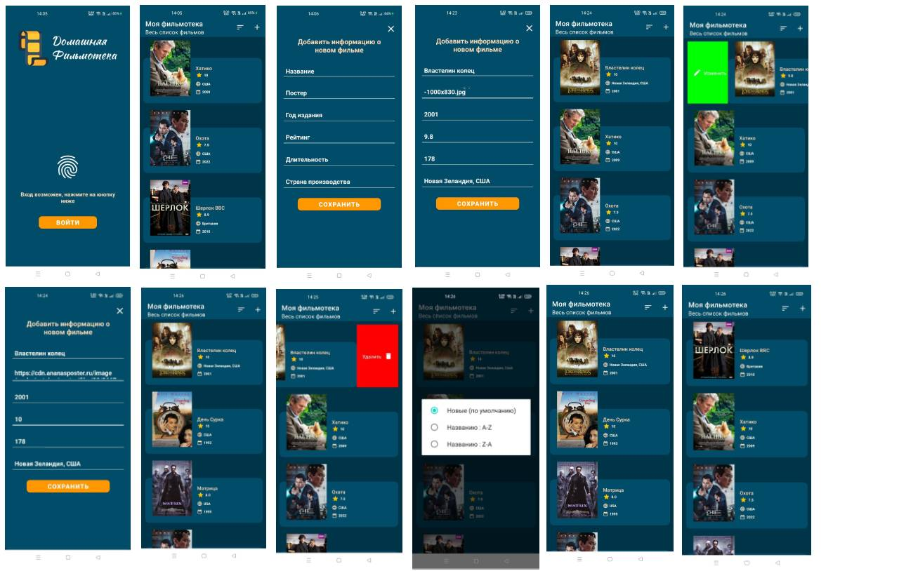

# Мобильное приложение "Домашняя Фильмотека" на Котлин 
Реализовано в рамках Цифровой Кафедры РТУ МИРЭА

## Функционал
* Биометрическая авторизация
* Добавление фильма
* Редактирование фильма
* Удаление фильма
* Сортировка списка фильмов по новизне/по алфавиту

## Используемые библиотеки и фреймворки
* MVVM
* Room Database
* Coroutines
* Flow
* Dagger Hilt
* Live Data
* View Binding
* DataStatus
* RecyclerView Swipe
* Fragment
* Coil
* Biometric

## Скриншоты

## APK файл
<a href="MyMovieApp.apk">Скачать APK</a>
